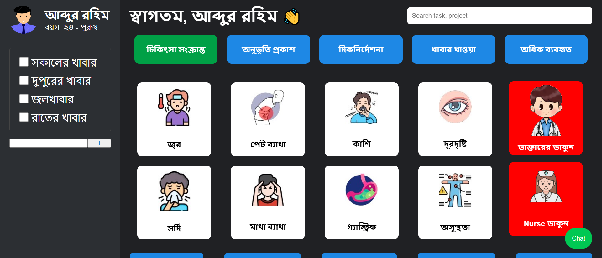

# AAC Communication System for Cerebral Palsy Patients

A research and development project focused on creating an **Augmentative and Alternative Communication (AAC) system** to assist cerebral palsy patients in communicating effectively. The system combines a **hardware device** and a **web application** for seamless interaction.

---

## 🛠️ Skills & Technologies
- **Frontend / Web:** HTML, CSS, JavaScript  
- **Hardware:** Circuit Design, Microcontrollers  
- **Other:** Research, System Design  

---

## ⚙️ Features
- **AAC Device:** Hardware interface to capture user inputs.  
- **Web Application:** Enables patients to communicate through the device.  
- **Real-time Interaction:** Patients can interact effectively with others.  
- **User-friendly Design:** Simple and intuitive for daily use.

- To select an icon user just have to hover over the icon for 10s. No need to click.
- Once user hover oven an icon - the text in the icon will read aloud after hover 5s.
- Add an alert button with sound (high pitch) it in

---

## 🖼️ Demo
Add your demo image(s) here. Example of **4 images side by side**:

  
  

---

---

## 📌 Usage
1. Connect the **AAC device** to the system.  
2. Launch the **web application**.  
3. Patients can **interact using the device**, and messages are displayed on the app.  
4. Track and analyze interactions for research purposes.

---

## 📞 Contact / Support
For any questions or suggestions, contact:  
**Email:** your-email@example.com  

---

## ⭐ Future Enhancements
- Add **speech synthesis** for spoken output.  
- Implement **cloud-based communication** for remote access.  
- Improve **device usability and ergonomics** for better patient comfort.
